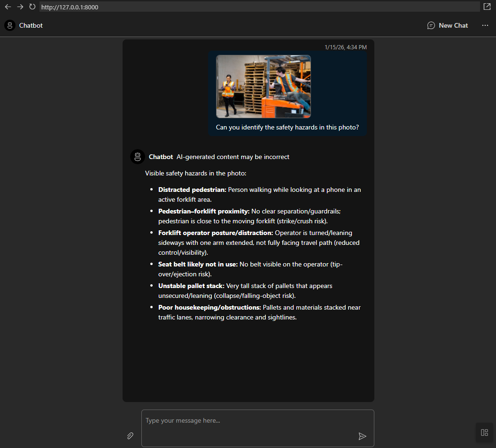

# Foundry Agent Accelerator

A **beginner-friendly starting point** for building AI agents with Azure AI Foundry. This accelerator creates a **persistent agent** in Foundry that you can customize, version, and manage through both code AND the Azure portal.

> **Perfect for:** Product managers, business analysts, and developers who want to quickly deploy and customize an AI agent without deep Python expertise.

## 🎯 What This Does

This accelerator gives you a **working AI agent** that:
- **Lives in Azure AI Foundry** - Visible and manageable in the portal
- **Has version history** - Every change creates a new version (both in Git AND Foundry)
- **Deploys to Azure** in minutes
- **Customizable** by editing simple text files (no coding required for basic changes)
- **Supports Foundry IQ** - Works with knowledge base agents and auto-formats citations



## ✨ Key Feature: Persistent Agents with Versioning

Unlike simple chat apps, this accelerator creates a **real agent** in Azure AI Foundry:

```
┌─────────────────────────────────────────────────────────────┐
│                    THE FLOW                                  │
│                                                              │
│  Edit system.txt → Restart app → New agent version created  │
│                                                              │
│  ✅ Version history in Git (your code)                       │
│  ✅ Version history in Foundry (operational)                 │
│  ✅ Agent visible in Azure AI Foundry portal                 │
└─────────────────────────────────────────────────────────────┘
```

## 📋 Table of Contents

- [Quick Start](#-quick-start)
- [Project Structure](#-project-structure)
- [How to Customize Your Agent](#-how-to-customize-your-agent)
- [Using GitHub Copilot to Configure Your Agent](#-using-github-copilot-to-configure-your-agent)
- [Understanding the Architecture](#-understanding-the-architecture)
- [Deployment](#-deployment)
- [Troubleshooting](#-troubleshooting)

---

## 🚀 Quick Start

### Prerequisites

- Azure subscription with Azure AI Foundry access
- A deployed chat model (like gpt-5.2) in your Foundry project
- Python 3.10+ installed (for local development)
- Azure CLI or Azure Developer CLI installed (for Azure deployment)

### Run Locally 

The fastest way to get up and running. Perfect for agent testing and development.

```bash
# 1. Clone and navigate to the project
git clone https://github.com/MaxBush6299/foundry-agent-accelerator.git
cd foundry-agent-accelerator

# 2. Copy and configure environment variables
cp .env.template src/.env
# Edit src/.env with your Azure AI Foundry details

# 3. Install dependencies
cd src
pip install -r requirements.txt

# 4. Run the application
uvicorn api.main:app --reload
```

Open http://localhost:8000 in your browser.


**On startup, you'll see:**
```
============================================================
STARTING FOUNDRY AGENT ACCELERATOR
============================================================
Connecting to Azure AI Foundry project...
----------------------------------------
CREATING/UPDATING AGENT IN FOUNDRY
  Agent Name: my-agent
  Model: gpt-4o-mini
  Instructions: You are a helpful assistant...
----------------------------------------
✅ Agent ready!
   ID: asst_abc123...
   Name: my-agent
   Version: 1
============================================================
AGENT READY - my-agent (v1)
Agent is visible in Azure AI Foundry portal!
============================================================
```

---

## 📁 Project Structure

```
foundry-agent-accelerator/
│
├── src/                          # 🎯 MAIN APPLICATION CODE
│   ├── api/                      # Backend Python code
│   │   ├── main.py              # Creates/updates agent in Foundry on startup
│   │   ├── routes.py            # Chat endpoint (sends messages to agent)
│   │   └── prompts/             # ⭐ EDIT THIS to customize your agent
│   │       └── system.txt       # Your agent's personality & instructions
│   │
│   ├── frontend/                 # Chat interface (React)
│   │   └── src/components/      # UI components
│   │
│   ├── agent.yaml               # ⭐ Enable tools (Code Interpreter, Bing, etc.)
│   ├── .env.sample              # Template for configuration
│   └── requirements.txt         # Python packages needed
│
├── .env.template                 # Environment variable template
└── docs/                         # Documentation
```

---

## 🔧 Configuration Modes

This accelerator supports two ways to configure your agent:

### Local Mode (Default) - For Developers

```bash
AGENT_CONFIG_SOURCE=local
```

- Agent configured via `prompts/system.txt` (personality) and `agent.yaml` (tools)
- Smart hash detection prevents version spam on restarts
- Version history tracked in Git AND Foundry

### Portal Mode - For Business Users

```bash
AGENT_CONFIG_SOURCE=portal
```

- Agent configured entirely in Azure AI Foundry portal
- Local config files are ignored
- Point-and-click configuration in the GUI

See [Environment Variables](docs/environment_variables.md) for details.

---

## 🧠 Foundry IQ Support

This accelerator fully supports **Foundry IQ** (knowledge base) agents configured in the Azure AI Foundry portal.

### Features

- **MCP Auto-Approval**: Automatically approves MCP tool calls, so knowledge base queries work seamlessly
- **Citation Formatting**: Citation markers like `【4:6†source】` are converted to clean footnote-style references with a sources list
- **Portal Mode Compatible**: Works with agents entirely configured in the Foundry portal

### Setup

1. Create your Foundry IQ knowledge base in Azure AI Foundry
2. Configure your agent with the knowledge base tool in the portal
3. Set your `.env` to use portal mode:

```bash
AGENT_CONFIG_SOURCE=portal
AZURE_AI_AGENT_NAME=your-foundry-iq-agent-name
```

4. Run the accelerator - it will automatically connect to your agent and handle MCP tool approvals

### How Citations Work

Foundry IQ returns citations in a raw format. This accelerator converts them:

**Before:** `The safety policy requires PPE【4:0†MMC_P7_Safety.md】`

**After:** `The safety policy requires PPE<sup>[1]</sup>`

With a sources section at the bottom:
```
---
📚 Sources:
[1] MMC P7 Safety
```

---

## ✏️ How to Customize Your Agent

### Change Your Agent's Behavior (No Coding!)

1. Open `src/api/prompts/system.txt`
2. Replace the text with your own instructions
3. Restart the application
4. **A new version of your agent is created in Foundry!**

**Example prompts:**

```
You are a friendly customer support agent for Contoso Electronics.
Help customers with product questions, troubleshooting, and returns.
Always be polite and empathetic. If you don't know something, say so.
```

```
You are a technical documentation assistant. Help developers
understand our API and provide code examples when helpful.
Be concise but thorough. Use markdown formatting in responses.
```

### Enable Agent Tools

Give your agent superpowers by editing `src/agent.yaml`:

```yaml
tools:
  code_interpreter:
    enabled: true  # Agent can run Python code!
  
  bing_search:
    enabled: true
    connection_name: "your-bing-connection"
```

**Available tools:**
| Tool | What It Does | Setup Required |
|------|--------------|----------------|
| `code_interpreter` | Run Python code, analyze data | None - works out of the box! |
| `bing_search` | Search the web (via Bing connection) | Create Bing connection in Foundry |
| `file_search` | Search uploaded documents | Create vector store in Foundry |
| `azure_ai_search` | Query your Azure search indexes | Create AI Search connection |
| `image_generation` | Generate images with gpt-image-1 | Deploy gpt-image-1 model |
| `web_search` | Real-time web search with citations | None - uses Bing Search (preview) |

> **Note:** `image_generation` and `web_search` are preview features. See [Azure docs](https://learn.microsoft.com/azure/ai-foundry/agents/how-to/tools) for details.

### Change the Agent Name

Set `AZURE_AI_AGENT_NAME` in your `.env` file:

```
AZURE_AI_AGENT_NAME=customer-support-agent
```

This is the name that appears in the Azure AI Foundry portal.

---

## 🤖 Using GitHub Copilot to Configure Your Agent

This project includes built-in instructions that help **GitHub Copilot** configure your agent. Just ask Copilot in natural language!

### Example Prompts

Try these in the VS Code Chat view:

- *"Create a customer support agent for my company"*
- *"Configure this as an image analysis agent"*
- *"What tools are available for my agent?"*
- *"Enable web search for my agent"*
- *"Change the agent personality to be more formal"*

Copilot will automatically read the project's configuration guidelines and edit the right files (`system.txt` and `agent.yaml`).

### Manually Attach Instructions

If Copilot doesn't pick up the instructions automatically, you can attach them manually:

1. Open the **Chat view** in VS Code
2. Click **Add Context** (or use the `@` symbol)
3. Select **Instructions**
4. Choose `.github/instructions/agent-configuration.instructions.md`
5. Ask your question

This ensures Copilot has full context about how to configure your agent.

### What the Instructions Cover

The included instructions guide Copilot to:

| Aspect | Guidance |
|--------|----------|
| System prompt structure | Personality, capabilities, restrictions, examples |
| Tool configuration | Which tools to enable and how to set them up |
| Best practices | Concise prompts, escalation paths, limitations |
| Example configurations | Customer support, research, data analysis agents |

---

### Environment Variables

| Variable | Required | Description |
|----------|----------|-------------|
| `AZURE_EXISTING_AIPROJECT_ENDPOINT` | ✅ Yes | Your Azure AI Foundry project URL |
| `AZURE_AI_CHAT_DEPLOYMENT_NAME` | ✅ Yes | Model name (e.g., "gpt-4o-mini") |
| `AZURE_AI_AGENT_NAME` | ✅ Yes | Name for your agent in Foundry |
| `AGENT_CONFIG_SOURCE` | ❌ No | `local` (default) or `portal` |
| `AZURE_TENANT_ID` | ❌ No | Only if you have multiple tenants |

---

## 🧠 Understanding the Architecture

### How It Works

```
┌────────────────┐     ┌──────────────┐     ┌─────────────────┐
│   system.txt   │────▶│   main.py    │────▶│  Foundry Agent  │
│  (your code)   │     │  (creates    │      │  (persistent,   │
│                │     │   version)   │     │   versioned)    │
└────────────────┘     └──────────────┘     └─────────────────┘
                                                     │
┌────────────────┐     ┌──────────────┐              │
│    Frontend    │────▶│  routes.py   │◀─────────────┘
│  (chat UI)     │     │  (sends to   │
│                │     │   agent)     │
└────────────────┘     └──────────────┘
```

### What Happens on Startup

1. **Load instructions** from `prompts/system.txt`
2. **Call `create_version()`** to create/update the agent in Foundry
3. **Agent is now live** and visible in the Foundry portal
4. **Ready to chat** - messages are routed to your agent

### What Happens When You Chat

1. User types a message
2. Frontend sends it to `/chat` endpoint
3. Backend forwards to Foundry Agent (by name)
4. Agent responds using its configured model and instructions
5. Response streams back word-by-word

### Versioning Flow

```
You edit system.txt
        ↓
Commit to Git (code version history)
        ↓
Restart/redeploy app
        ↓
create_version() called
        ↓
New version created in Foundry
        ↓
Both Git AND Foundry have history!
```

---

## 🚢 Deployment

### Deploy to Azure

```bash
azd up
```

This creates:
- Azure Container App (runs your agent)
- Azure AI Services (provides the AI model)
- Container Registry (stores your app)

### Update Your Agent

```bash
# 1. Edit src/api/prompts/system.txt
# 2. Redeploy
azd up
# A new version is created in Foundry!
```

### Clean Up Resources

```bash
azd down
```

---

## ❓ Troubleshooting

### Common Issues

| Problem | Solution |
|---------|----------|
| "Agent not created" | Check `AZURE_AI_AGENT_NAME` is set |
| "401 Unauthorized" | Run `azd auth login` or `az login` |
| "Model not found" | Verify `AZURE_AI_CHAT_DEPLOYMENT_NAME` matches your deployment |
| Agent not in portal | Check `AZURE_EXISTING_AIPROJECT_ENDPOINT` is correct |

### Viewing Your Agent in the Portal

1. Go to [Azure AI Foundry](https://ai.azure.com)
2. Open your project
3. Click "Agents" in the sidebar
4. You should see your agent with version history!

---

## 📚 Additional Documentation

- [Environment Variables](docs/environment_variables.md) - All configuration options
- [Code Walkthrough](docs/code_walkthrough.md) - How the code works
- [Deployment Guide](docs/deployment.md) - Detailed deployment instructions
- [Local Development](docs/local_development.md) - Setting up your dev environment

---

## 💰 Resources & Costs

| Resource | Purpose | Pricing |
|----------|---------|---------|
| Azure Container App | Runs your agent | ~$0.03/hour when active |
| Azure AI Services | AI model access | Per-token pricing |
| Container Registry | Stores app image | ~$5/month |


---

## 📄 License

MIT License - see [LICENSE](LICENSE) for details.

---

## 🙏 Acknowledgments

Based on the [Azure Samples - Get Started with AI Chat](https://github.com/Azure-Samples/get-started-with-ai-chat) template.
